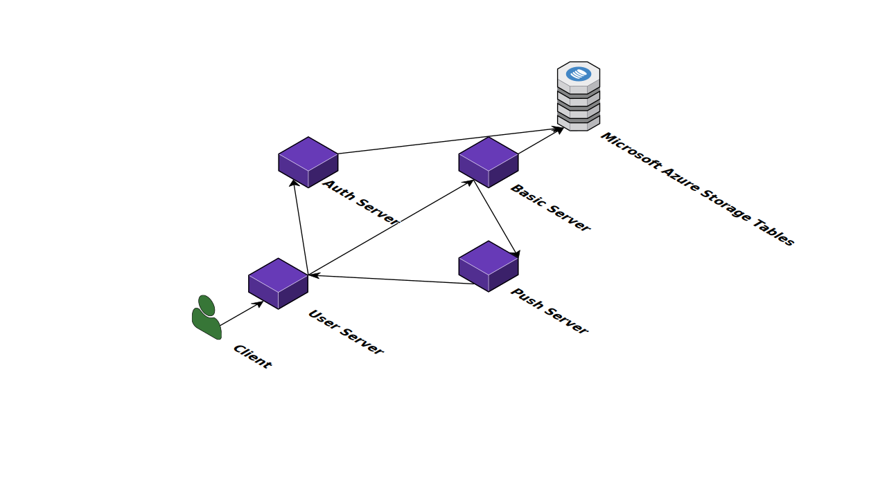

# Phaser

Set of C++ servers built with the [Microsoft C++ REST SDK](https://github.com/microsoft/cpprestsdk) which works as a back-end storage service in conjunction with [Microsoft Azure Storage](https://docs.microsoft.com/en-us/azure/storage/).

## Software Stack

| Purpose | Technology |
| --- | --- |
| Development Language | C++ |
| Back-End Web Server Framework | [Microsoft C++ REST SDK](https://github.com/microsoft/cpprestsdk) |
| Testing Framework | [UnitTest++](https://github.com/unittest-cpp/unittest-cpp) |
| Build System | [CMake](https://cmake.org/) |
| Application Container | [Vagrant](https://www.vagrantup.com/) |
| Database (Online) | [Microsoft Azure Storage](https://docs.microsoft.com/en-us/azure/storage/) |

## Setup

First, clone the repository to your local machine and enter the project directory:
```shell
git clone https://github.com/jleung51-coursework/phaser.git
cd phaser/
```

The cleanest way to run the server is to run it inside a virtual machine. To do this, install [VirtualBox](https://www.virtualbox.org/) and [Vagrant](https://www.vagrantup.com/) on your machine.

Build the virtual machine using the Vagrantfile in the project directory:
```shell
vagrant up
```

This will take some time to build.

Enter the virtual machine:
```shell
vagrant ssh
```

Further instructions under construction...

## Directory Structure

The `src/` directory contains the C++ source files for the servers.

The `include/` directory contains all header files.

The `build/` directory contains all the testing files, as well as the CMake build script.

# Architecture

[](https://cloudcraft.co/view/2fd5c9e2-af62-4f6b-bd66-0a8c4ca37062?key=twz6SxA3DCjY9L6F8anEvw)

There are 4 discrete servers in the system.

1. `BasicServer` handles standard Create/Read/Update/Delete operations to the databases.
2. `AuthServer` handles authentication and token access through directly interfacing with the databases as well.
3. `PushServer` takes notifications of updates from `BasicServer` and sends them to the user.
4. `UserServer` is the direct and only interface of the client, requesting and receiving data from the other 3 servers as required.

# About

This project was a group project in CMPT 276: Introduction to Software Engineering at Simon Fraser University for the Spring 2016 semester.

## Main Contributors

* Daphne Chong
* Jeffrey Leung
* Yi-Hsuan Wu
* Joshua Wu
